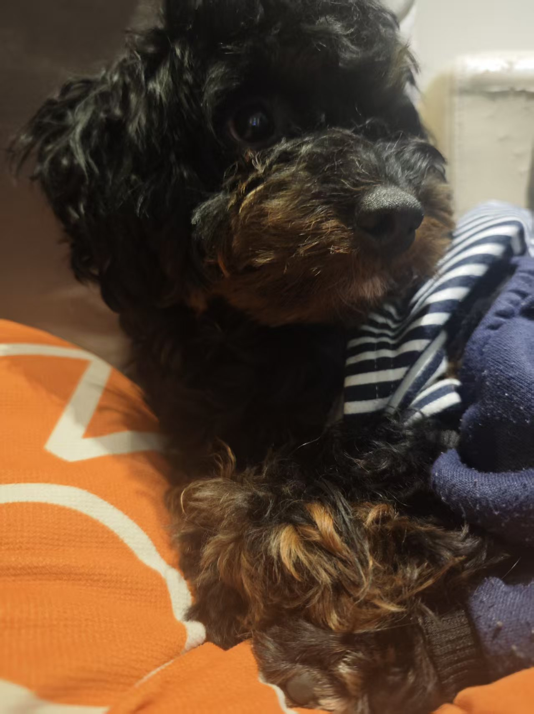
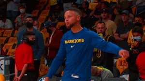

# Hello, I'm FangliangZHENG

I'm currently work in LLM, and interested in CG. 

  
  
 <em>My Pet: YuanBao</em>

## Education

- Bachelor, in Electronic Information Engineering  
  *Xidian University (2021 – 2026)*

- Research Student, in Information Science and Technology  
  *Kyushu University (2026 – 2027)*  

## Tech & Learning

- C++ & OpenGL: I'm interested in Computer Graphics and their applications in Game Design.
- Python & LLM: LLM's application in High Performance Physics Computation is also one of my interests.
- Maths & Physics: They are always engaging.

## Anime & Basketball

When I'm not coding, you can find me:  
- Playing Basketball with friends 🏀  
- Watching Anime

  

## Let's Connect

- Email-1: FangliangZHENG@outlook.com
- Email-2: Zheng.Fangliang125@gmail.com

*Feel free to check out my repos and star what you like!*
